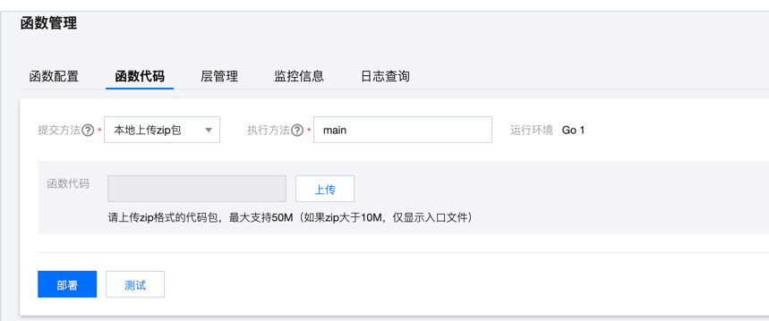

# Vika golang SDK Example for SCF

[Vika](https://vika.cn) Golang SDK 结合腾讯云函数的一个应用。
## 功能描述
从vika表读取数据，进行批量删除。每次读取100条记录删除

## 简单上手
### 环境要求

go 1.15 +  

### 1. 依赖安装

```shell
go mod tidy
```
### 2. 编译打包
* 在 Linux 或 MacOS 的终端通过如下方法完成编译及打包：

```shell
GOOS=linux GOARCH=amd64 go build -o main main.go

zip main.zip main
```

* 在 Windows 下打包：  
由于up主没有在windows系统进行测试，所以请参考腾讯云函数[Golang部署文档](https://cloud.tencent.com/document/product/583/67385)

### 3. 上传打包好的zip包


### 4. 添加环境变量
请在云函数添加如下环境变量

```YAML
# vika数表ID
DATASHEET_ID

# 需要排序的字段
SORT_FIELD_NAME

# 视图字段
VIEW_ID

# api token 访问维格表的工作台，点击左下角的个人头像，进入「用户中心 > 开发者配置」。点击生成Token(首次使用需要绑定邮箱)。
VIKA_TOKEN=
```

## todo
